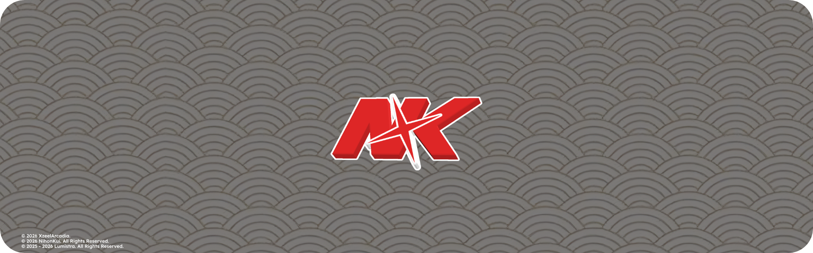

# NihonKui

<p align="center">
  
</p>

<h3 align="center">Do you like anime or are you planning a trip to Japan? Test your Japanese skills now! 🌸</h3>

## Features

- A comprehensive collection of Japanese language quizzes
- Modern & clean UI
- Cool animations
- Light/dark mode toggle

## Tech Stack

- Vite
- TypeScript
- React
- Tailwind CSS
- Motion

## License

```
© 2026 XzeelArcadia.
© 2026 NihonKui. All Rights Reserved.
© 2025-2026 Lumistra. All Rights Reserved.

This project is not open source.
You are not allowed to copy, modify, or reuse any part of this code without permission.
```
